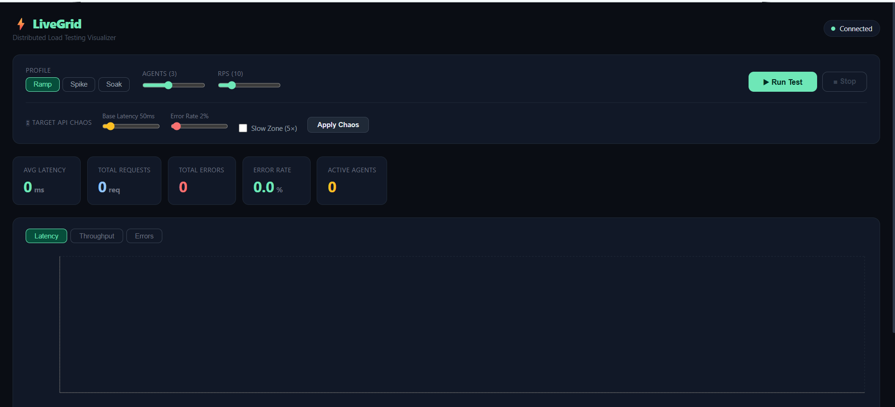
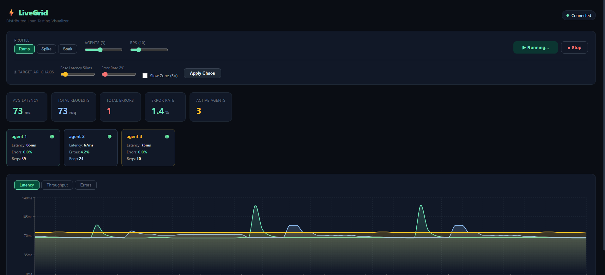
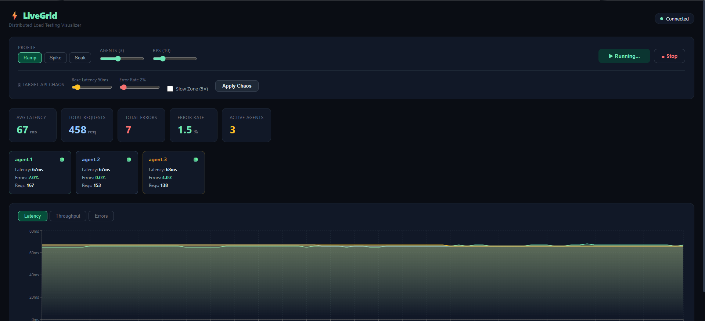
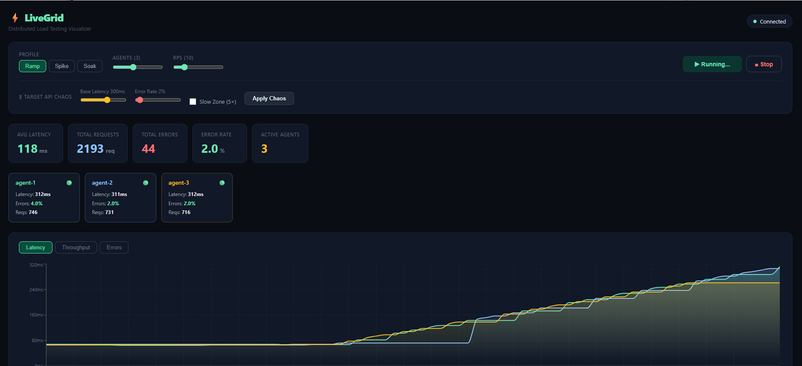
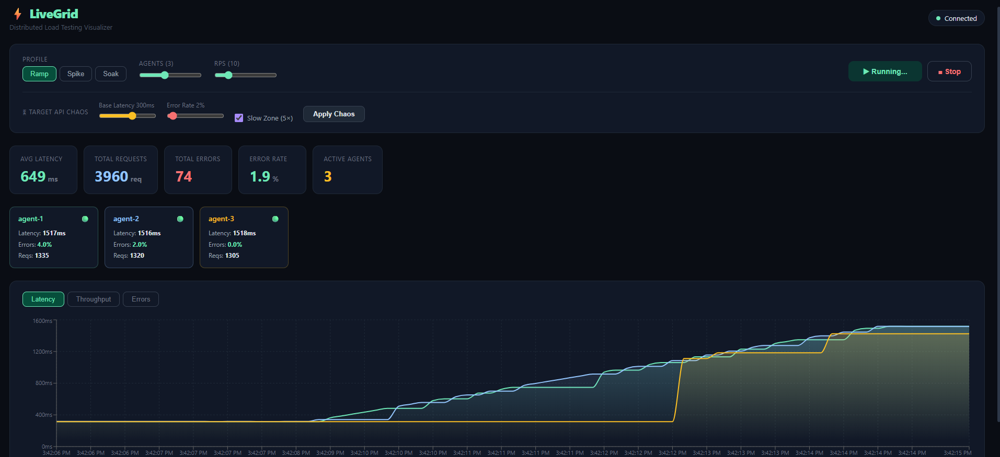
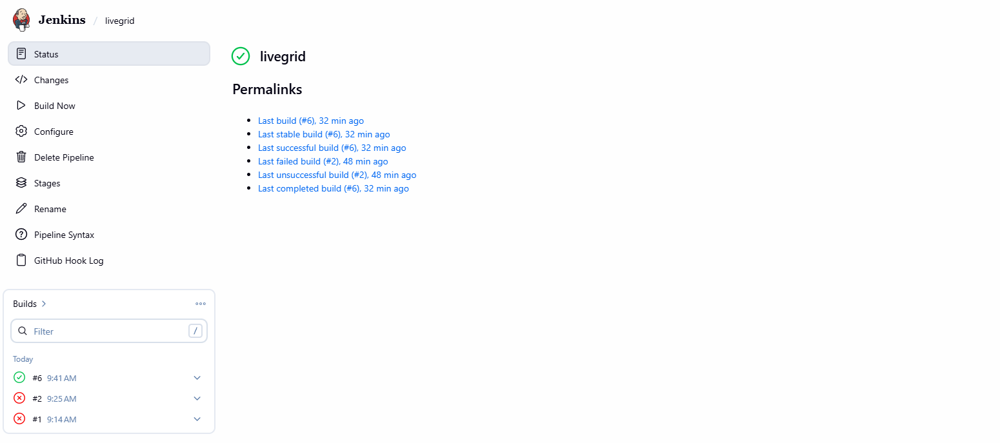

#  LiveGrid — Distributed Load Testing Visualizer

> Watch your API break in real time, before production does.



LiveGrid is a full-stack distributed load testing tool that fires real HTTP requests at a target API using multiple concurrent agents, streams live metrics over WebSockets, and visualizes latency, throughput, and error rates on a real-time dashboard — all deployed on AWS EC2 with Docker and automated CI/CD via Jenkins.

---

##  Run It Yourself

Clone the repo and run locally with Docker — see [Run Locally](#-run-locally) section below.

Or deploy on your own AWS EC2 free tier — see [Deploy on AWS](#-deploy-on-aws-ec2-free-tier) section below.

---

##  What Makes This Different

Most load testing tools (k6, JMeter) are CLI-only — you run a test and read a report after. LiveGrid lets you **watch it happen live** and **inject chaos mid-test**. You can crank up latency from 50ms to 300ms while the test is running and see all agents respond on the chart in real time.

This isn't a tutorial project. It's a working system with:
- Real WebSocket pub/sub architecture
- Containerized agents that simulate distributed load
- A chaos engineering control panel
- A Jenkins pipeline that rebuilds and redeploys on every GitHub push

---

##  Tech Stack

| Layer | Technology |
|---|---|
| Frontend | React 18, Vite, Recharts |
| Real-time | WebSockets (`ws` library) |
| Backend | Node.js, Express |
| Load Agents | Node.js child processes |
| Containers | Docker, Docker Compose |
| CI/CD | Jenkins (Pipeline as Code) |
| Cloud | AWS EC2 t3.micro |
| Web Server | Nginx (serves React build) |

---

##  Architecture

```
Browser (React Dashboard)
    ↕  WebSocket — live metric stream
    ↕  REST API  — start / stop / chaos config

Node.js Orchestrator (server)
    └── spawns N agent processes
            └── fires HTTP → Target API
            └── stdout → JSON metrics → WS broadcast

Target API (Express)
    └── configurable latency, error rate, slow zone
```

Each agent is an isolated Node.js process. In a real AWS setup, these would be separate EC2 instances in an Auto Scaling Group — the architecture maps directly.

---

##  How to Use It

### Step 1 — Open the dashboard
Navigate to `http://13.60.148.112:3000`. You'll see the clean control panel with all stats at zero.


---

### Step 2 — Run a Ramp test
Select **Ramp** profile, set 3 agents and 10 RPS, then click **Run Test**. Agents spin up one by one — watch the agent cards appear and the latency chart start drawing.



---

### Step 3 — Stable baseline
After 30 seconds the system reaches a stable baseline. All 3 agents show ~65ms latency, 2% error rate matching the configured target. Three colored lines run flat across the chart.



---

### Step 4 — Inject Chaos 
**This is the key demo moment.** Drag Base Latency to **300ms** → click **Apply Chaos**. All agents immediately respond — latency jumps from 65ms to 316ms on the live chart. The spike is instant and visible across all 3 agent lines simultaneously.



---

### Step 5 — Enable Slow Zone
Tick **Slow Zone (5×)** → Apply Chaos again. The target API now runs at 5× base latency. Agents hit 1500ms+, error rates climb, and agent cards flip to warning colors. This simulates a degraded upstream dependency.



---

### Step 6 — Jenkins CI/CD Pipeline
Every `git push` triggers Jenkins to pull the latest code, rebuild all Docker images, run a smoke test against the target API, deploy all containers, and verify health checks. The entire pipeline runs automatically without manual intervention.



---

## ⚙️ Jenkins Pipeline Stages

```
 Checkout       → pulls latest code from GitHub
 Build Images   → docker compose build --no-cache
 Smoke Test     → spins up target API, hits /health
 Deploy         → docker compose up -d (all 3 services)
 Health Check   → verifies all endpoints respond
```

If any stage fails, Jenkins automatically rolls back by running `docker compose down`.

---

##  Project Structure

```
livegrid/
├── dashboard/          # React + Recharts frontend (Vite)
│   ├── src/App.jsx     # Main dashboard component
│   └── Dockerfile      # Node 20 builder → Nginx serve
├── server/             # Node.js WebSocket + REST orchestrator
│   ├── index.js        # WS server + agent spawner + REST API
│   └── agent.js        # Load agent (fires HTTP, streams metrics)
├── target-api/         # Express dummy API (the thing being tested)
│   └── index.js        # Configurable latency, errors, slow zone
├── docker-compose.yml  # Production deployment
├── Jenkinsfile         # CI/CD pipeline definition
└── setup-ec2.sh        # One-command EC2 bootstrap script
```

---

##  Run Locally

```bash
# Prerequisites: Docker Desktop installed

git clone https://github.com/Priyanshi0275/livegrid.git
cd livegrid
docker compose up --build

# Open http://localhost:3000
```

All 4 services start automatically. No other setup needed.

---

##  Deploy on AWS EC2 (Free Tier)

```bash
# 1. Launch Ubuntu 22.04 t2.micro on AWS
# 2. SSH in and run setup script
bash <(curl -fsSL https://raw.githubusercontent.com/Priyanshi0275/livegrid/main/setup-ec2.sh)

# 3. Clone and run
git clone https://github.com/Priyanshi0275/livegrid.git
cd livegrid
docker compose up --build -d
```

Open ports 3000, 3001, 3002, 4000, 8080 in your EC2 Security Group.

---

##  What the Metrics Mean

| Metric | Description |
|---|---|
| Avg Latency | Rolling average response time across last 50 requests per agent |
| Total Requests | Cumulative requests fired since test start |
| Error Rate | % of non-2xx responses in the sliding window |
| Active Agents | Number of agent processes currently running |
| Throughput | Requests in the current sliding window per agent |

---

## 👩‍💻 Author

**Priyanshi Mishra**  

---
